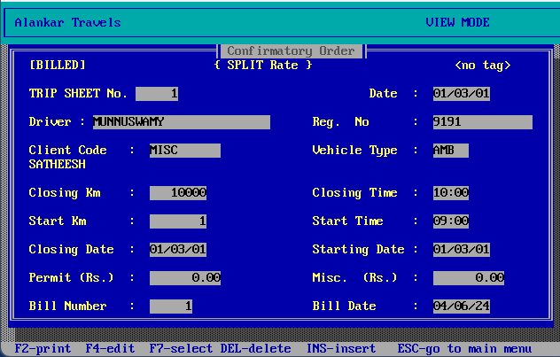
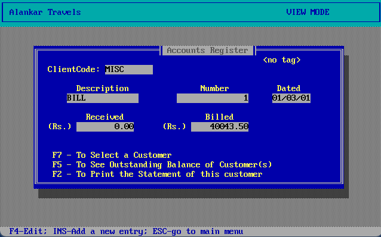
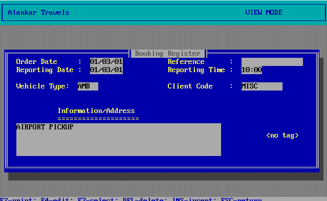
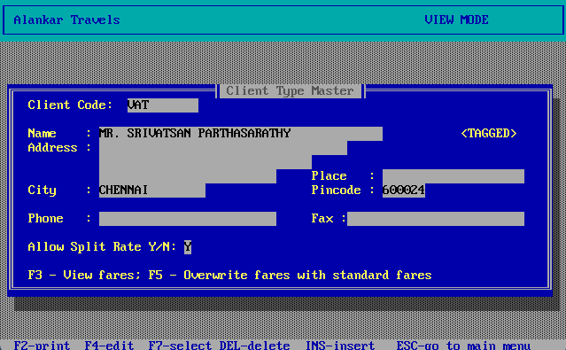
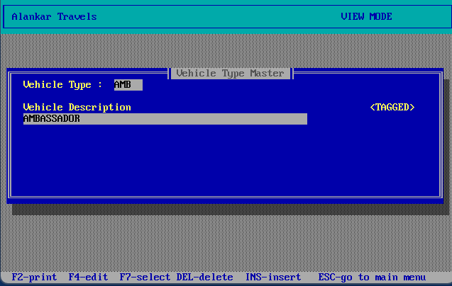
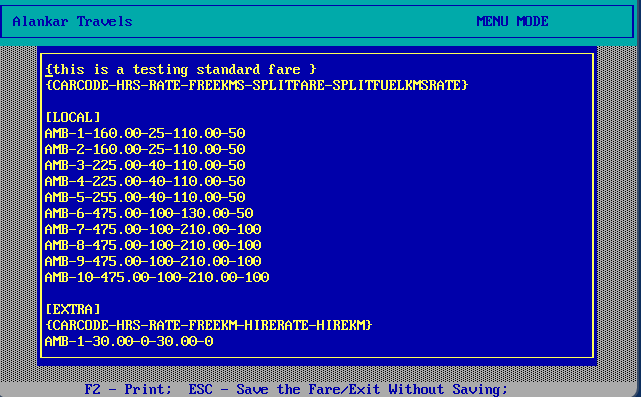
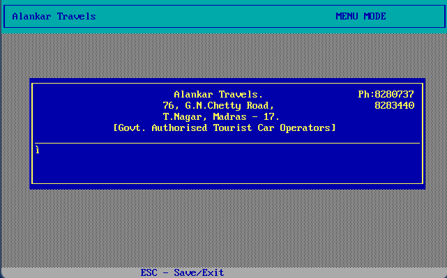
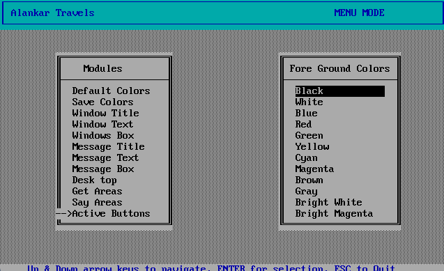
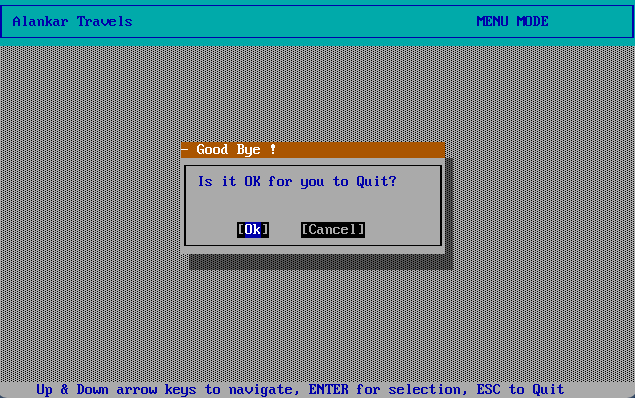

# Alankar
A Clipper 5.x application for Taxi booking, inventory management written for MS-DOS in 1995. 

Alankar Travels, was a Chennai (then Madras), Tamil Nadu, India based boutique local taxi services firm in the 1990s. They were operating several cars, Hindustan Motors Ambassadors and other vehicles for rental services to the city based corporate companies, banks and for others. To manage their fleet of vehicles, their clients, the bookings, generate trip sheets (scheduling) and invoice they needed a software. This was in 1995, and their operators were not comfortable with Graphical User Interface, so Windows 3.x or Windows 95 was not a choice, so I decided to opt for a MS-DOS based application. I went with developing an application in my (then)favourite programming environment Clipper 5.x. Rick Spence’s Clipper Programming Guide (2nd Edition, Version 5) and Clipper 5.2 Power Programming Guide were my favourite books. 

## Introduction
The application allowed the user, remember this was a single-user application, the staff of the travel company to:
1. Create a list of customers, their addresses and manage them.
1. Create a list of vehicles (their fleet) and manage them (add/modify/delete).
1. Create a list of bookings including the vehicle type requested and the date & time.
1. The Confirmation Order called Trip sheet, allowed the mapping of vehicle, customer, the driver and the charges.
1. Accounts Master to manage the receipts, and generate reports
1. Standard Fares is the ratecard for various vehicle types and per kilometre/time. It is kept as a simple text file, and parsed on runtime. This avoided writing a complete fares management system.
1. Header Modify is to modify the header information in the reports/invoices generated. It is kept as a simple text file, and parsed on runtime. This avoided writing a report management system.
1. Color settings is to allow modifying the entire user-interface colour schemes for the application to your hearts content, including the text, border, background and more. 

## Application Architecture and highlights
The application was written mostly following the Object-Oriented Programming concepts prevailing in the time, and best practices recommended in the Rick Spence book for Clipper 5.x. Clipper 5.x was the first OOPS based environment for dBase clone programming. 

All the screens in the application were generated from a single UI class [Form management Class] which provided common functionality like drawing the border, background, interception of keys for functionality like up, down, tag, untag, print and so on. This meant each screen had to implement only the required business functionality (like vehicle management) and leave out the UI management and navigation to the base class. As an engineering student then (in 1995) I was proud of my work here. 

The executable file (alankar.exe) when run the first time, will detect there are no dBase (DBF) database files. It will automatically create new, empty database files with template data, this enabled the application to be copied and run on a new machine easily and testing was made easy. 

## Download
The entire Clipper 5.x source code is given here, you need Clipper 5.x compiler to build new binaries from any changes you may make.

I have provided the binary (.exe) file ready in the release folder. It will run in any MS-DOS compatible environment, the empty databases (DBF) will be autogenerated on the first run. 

I have tested the app today (June 2024) in Windows 11 with DosBox emulator which you can download from their [website](https://www.dosbox.com/) or use the following Winget command: `winget install DOSBox.DOSBox`. Once installed, copy the `alankar.exe` file to a folder say in `C:\Alankar`, then run Dosbox, then use `Mount C C:\Alankar` inside Dosbox, then go to 'C:\Alankar', to finally run 'Alankar.exe'. 

## Screenshots 
Below are screenshots of the various screens in the application. 

